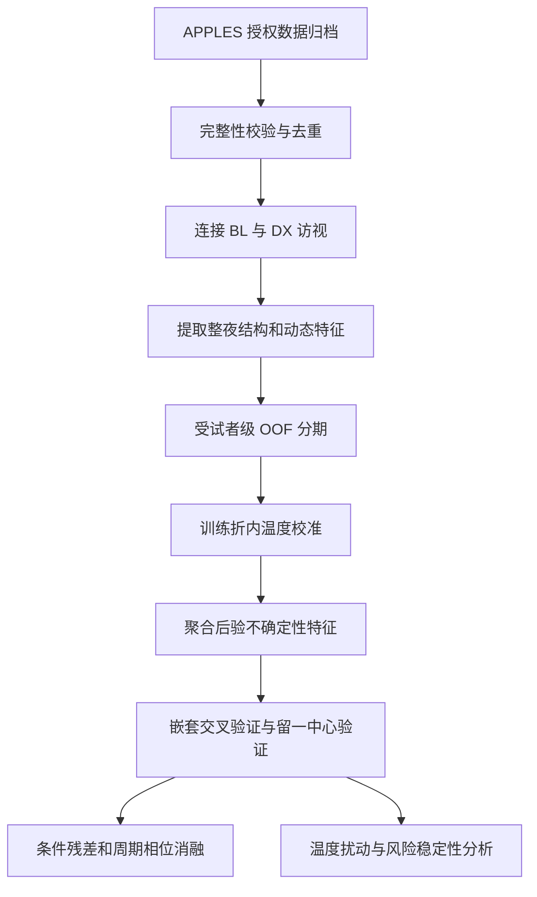

# 睡眠分期不确定性与抑郁症状辅助评估研究汇报

**汇报日期：** 2026 年 9 月  
**研究阶段：** 探索性验证  
**研究对象：** APPLES 队列中的成年阻塞性睡眠呼吸暂停人群

> 本文区分三类证据。`[1]` 至 `[16]` 指同行评议论文或正式会议论文；`[P1]` 至 `[P12]` 指本项目代码、数据清单或聚合结果；“研究假设”和“后续计划”表示尚待验证的内容。项目结果只说明当前样本和评估协议下观察到的现象，不自动构成医学规律。

## 汇报摘要

本研究考察一个具体问题：在人口学、OSA 严重度、睡眠宏观结构和阶段转移特征之外，经过校准的睡眠分期后验不确定性，能否为抑郁症状风险评估提供增量信息。

APPLES 是一项多中心、随机、双盲、假治疗对照的 CPAP 临床试验，研究对象是 OSA 患者，而非专门招募的抑郁症队列。[10] 本项目从本地整理出的 1073 名受试者中，纳入 798 名具有有效 YASA 派生特征且总睡眠时间不少于 4 小时的受试者。[P1][P2]

当前最稳定的结果来自 ExtraTrees 分期模型。采用受试者隔离的五折 OOF 评估，并在每个训练折中额外留出 20% 受试者拟合温度参数后，分期 ECE 从 0.0831 降至 0.0158，NLL 从 0.6360 降至 0.6102。[P3][P4] 在 `HAMD>=8` 的症状阈值分类中，加入校准后验不确定性后，嵌套交叉验证 AUROC 从 0.6348 上升到 0.6745，配对增量为 0.0401，95% 区间为 0.0108 至 0.0712；留一中心 AUROC 从 0.6242 上升到 0.6589，增量为 0.0347，95% 区间为 0.0021 至 0.0682。[P5]

该结果属于探索性证据。连续 BDI-I、连续 HAMD、BDI 阈值分类和 SGD backbone 没有稳定复现同样的增量；条件残差与周期相位特征在当前实现下还降低了 HAMD 阈值分类性能。[P5] 因此，目前可以提出“校准后验不确定性可能含有补充信息”，不能声称发现了抑郁症生物标志物，也不能把模型输出解释为临床诊断。

## 实验背景

### 睡眠改变与抑郁存在群体层面的关联

睡眠连续性下降、慢波睡眠减少、REM 潜伏期缩短和 REM 密度升高，是抑郁睡眠研究中反复讨论的群体差异。[1][2] 2024 年的系统综述与荟萃分析进一步报告，单相抑郁患者整体表现出 REM 潜伏期缩短和 REM 密度升高。[3]

这些结果提供了研究睡眠 EEG 与抑郁症状关系的生理依据，但不支持把单一睡眠指标当作抑郁症诊断标志。Riemann 等明确指出，早期希望利用 REM 异常鉴别抑郁亚型的设想没有成为可靠的特异性诊断方法。[1] 抗抑郁药、年龄、性别和睡眠疾病也会改变睡眠结构及频谱特征。[1][2][11]

### 自动睡眠分期已经开始输出可用的概率信息

自动睡眠分期通常把每个 30 秒片段分为 W、N1、N2、N3 或 REM。L-SeqSleepNet 证明，显式建模长序列和睡眠周期有助于自动分期，并在多个数据库和 EEG 设置上进行了验证。[4] SleepTransformer 除了输出阶段标签，还利用后验分布的熵表示模型对分期决策的不确定程度。[5]

后验熵是模型输出概率的函数，不等同于原始 EEG 的信号熵，也不等同于已经得到生理验证的“睡眠稳定性”。SleepTransformer 只证明后验熵可用于识别低置信度片段和辅助人工复核，没有研究它与抑郁症状的关系。[5] van Gorp 等也指出，分期不确定性可能来自记录本身的模糊性，也可能来自模型知识不足或域偏移。[6]

### 不确定性研究主要停留在分期复核

已有研究表明，利用不确定性选择需要人工复核的片段，可以提高自动分期与专家评分的一致性。Kang 等在 20 项睡眠记录中报告，基于 Shannon 熵的复核流程使 Cohen's kappa 平均提高约 0.28，并减少约 60% 的人工评分时间。[7] Bechny 等在大规模公开和临床 PSG 上发现，置信模型能够识别错误分期，人工检查不足 29% 的不确定片段即可达到较高一致性。[8] U-PASS 在老年 OSA 数据中也报告了不确定性引导复核带来的分期性能改善。[9]

这些论文支持“不确定性可服务于分期质量控制”，但没有证明分期后验熵能够预测抑郁症状。[7][8][9] 本研究把这层关系作为待检验问题。

## 相关研究与本项目位置

| 研究 | 已有证据 | 尚未回答的问题 | 与本项目的关系 |
|---|---|---|---|
| L-SeqSleepNet [4] | 长序列信息有助于自动睡眠分期 | 未研究抑郁结局，也未定义可直接用于本项目的整夜抑郁表征 | 提供现代长序列分期基线 |
| SleepTransformer [5] | 后验熵可量化分期模型的不确定性 | 未证明后验熵具有抑郁相关生理含义 | 提供不确定性计算依据 |
| van Gorp 等 [6] | 区分偶然不确定性与认知不确定性 | 未建立抑郁预测模型 | 约束本项目对 entropy 的解释 |
| Kang、Bechny、U-PASS [7][8][9] | 不确定性可用于分期人工复核 | 未验证下游抑郁症状评估 | 支持质量控制，不直接支持疾病结论 |
| Pan 等 [12] | 自动分期后的睡眠结构特征可用于抑郁相关分类 | 未研究概率校准和后验不确定性的增量 | 构成本项目的直接近邻工作 |
| Bovy 等 [11] | 三个 MDD 睡眠队列显示睡眠宏观及微结构效应受队列和用药影响 | 未提供可用于本项目的逐 epoch 后验 | 用于检验传统睡眠特征的跨数据集稳定性 |
| Enkhbayar 等 [13] | PSG 表型、人口学和问卷变量可用于抑郁预测 | 只有交叉验证，标签来自自报诊断，未使用分期后验 | 说明传统 PSG 表型是必要对照 |
| SleepFM [14] | 大规模多模态 PSG 预训练可迁移到分期和疾病风险任务 | 疾病预测属于关联建模，且模型训练成本高 | 说明单纯“预训练 PSG 模型加疾病分类”不足以构成本项目创新 |

据此，本项目的研究位置可以表述为：验证“折内概率校准、整夜不确定性聚合和抑郁症状评估”这一组合是否具有增量价值。现有证据不足以支持“首次提出”或“填补空白”的表述。

## 研究问题

本项目当前检验两个层次的问题。

**主要研究问题：** 在 APPLES 的 OSA 人群中，校准后的睡眠分期后验不确定性，能否在年龄、性别、种族、BMI、中心、AHI、觉醒指数、睡眠宏观结构和阶段动态之外，提高 `HAMD>=8` 症状阈值分类的判别能力？

**扩展研究问题：** 当分期温度参数受到小幅工程扰动时，风险评分跨越 0.5 阈值的受试者是否更容易被错误分类？这种方法能否优于按风险评分距 0.5 的距离进行拒绝的简单基线？

`HAMD>=8` 的口径来自 HAMD-17 严重度分组中“0 至 7 无抑郁、8 至 16 轻度”的建议。[15] 该分组是在已确诊 MDD 的门诊患者中研究得到的，尚不能证明 `HAMD>=8` 是 APPLES OSA 人群的有效诊断阈值。[15] 因而本文统一使用“HAMD 症状阈值分类”，不使用“抑郁症阳性诊断”。

## 数据集

### APPLES 主分析队列

APPLES 的原始研究目标是评价 CPAP 对 OSA 患者神经认知、情绪、嗜睡和生活质量的长期影响。研究采用五中心、随机、双盲和假 CPAP 对照设计，计划纳入约 1100 名受试者。[10]

本项目使用的数据经过以下整理：

| 数据层 | 本项目实际情况 | 依据 |
|---|---:|---|
| 合并后的临床队列 | 1073 人 | [P1][P2] |
| 有效 YASA NPZ | 847 人 | [P1] |
| TST 不少于 4 小时的主分析样本 | 798 人 | [P1][P2] |
| 有效单通道 C4-M1 原始波形 NPZ | 483 人 | [P1] |
| 可匹配临床结局的单通道原始波形 | 471 人 | [P1] |
| 满足 4 小时标准的单通道原始波形 | 443 人 | [P1] |
| 主分析中的 `HAMD>=8` 受试者 | 147 人 | [P6] |

当前分期模型读取 YASA NPZ 中的 114 维 epoch 特征。NPZ 的通道元数据包含多个 EEG 导联、EOG 和 EMG，因此现阶段应表述为“多通道 PSG 派生特征”，不能表述为端到端单通道 EEG 模型。[P1][P3] 443 人的 C4-M1 原始波形尚未进入当前统计结果。[P1]

APPLES 是 OSA 富集队列。年龄、BMI、AHI、觉醒指数和中心差异都可能同时影响睡眠结构、分期难度和情绪量表，因此这些变量必须进入基线模型。[P7] 当前结果的适用范围应限制在与 APPLES 相似的成年 OSA 人群。

### Sleep-EDF 工程验证

项目使用 L-SeqSleepNet 仓库提供的 39 晚 Sleep-EDF 数据验证睡眠结构和动态特征提取代码。特征提取共得到 64 个整夜特征，没有失败记录。[P8] Sleep-EDF 在本项目中只用于验证特征计算流程，不含抑郁结局，不能作为抑郁评估的验证集。

### Bovy 2022 外部数据

项目还使用 Bovy 等公开的三个 MDD 睡眠队列进行留一数据集验证。去除跨数据集重复样本后，共纳入 219 条记录；具有完整动态特征的样本为 213 条。[P9][P10] 三个队列在用药状态、设备和通道参考方面存在差异，且公开数据没有逐 epoch 分期 posterior，因此只能验证传统睡眠结构、动态和微结构特征，不能验证本项目的校准 entropy。[P9][P10]

## 代码与实验路径

当前工程按以下顺序执行：

| 环节 | 代码文件 | 实际实现 |
|---|---|---|
| 数据清理 | `scripts/curate_apples_archive.py` | 校验 NPZ 必要成员，剔除损坏文件，按既定规则处理重复 raw NPZ，记录 SHA-256 和 manifest |
| 队列构建 | `scripts/build_apples_cohort.py` | 连接 BL 与 DX 访视，检查 `fileid` 唯一性和量表一致性 |
| 序列特征 | `scripts/extract_apples_sequence_features.py` | 从人工阶段序列提取宏观结构、bout 和转移特征 |
| 核心特征库 | `src/sleepdep/features.py` | 实现睡眠结构、转移、后验熵、margin、边界差异和周期特征 |
| 临床基线 | `scripts/run_apples_clinical_experiments.py` | Ridge 回归、平衡权重 Logistic Regression、嵌套 CV 和留一中心验证 |
| OOF 后验 | `scripts/generate_apples_oof_posteriors.py` | SGD 或 ExtraTrees 分期，每个训练折另留 20% 受试者拟合温度和条件 entropy 基线 |
| 后验消融 | `scripts/run_apples_posterior_experiments.py` | 比较 E3、E4、E5 和 E6，使用 5000 次配对 bootstrap |
| 风险稳定性 | `scripts/run_apples_risk_stability.py` | 对温度参数施加工程扰动，计算风险区间、阈值跨越和 coverage-risk |
| Bovy 外部验证 | `scripts/run_bovy_external_validation.py` | Logistic Regression 或 Ridge，采用 leave-one-dataset-out |

## 特征与模型

### 睡眠结构和动态特征

`src/sleepdep/features.py` 实现了以下特征：[P7]

- 睡眠结构：总睡眠时间、睡眠效率、入睡潜伏期、WASO、REM 潜伏期和各阶段比例。
- 阶段动态：每小时阶段切换次数、短睡眠 bout 比例、各阶段 bout 时长和阶段转移概率。
- 后验不确定性：归一化 entropy 的均值、标准差、90 分位数、posterior margin、边界与稳定片段差异及分阶段 entropy。
- 探索性特征：条件 entropy 残差、NREM-REM 周期四相位均值、REM 前均值和周期间漂移。

归一化 entropy 的计算为：

$$
H(p)=-\frac{\sum_{k=1}^{5}p_k\log p_k}{\log 5}
$$

这里的 $p_k$ 是模型对五个睡眠阶段的预测概率。该指标描述概率分布的分散程度，只能直接解释为“模型分期决策的不确定程度”。[5][6]

### 分期模型与温度校准

ExtraTrees 使用 160 棵树，`min_samples_leaf=3`、`max_features=sqrt` 和类别平衡权重。[P3] 每个外层训练折先划出 20% 受试者作为独立校准集，随后以 NLL 为目标拟合单一温度参数，搜索范围为 0.2 至 5.0。[P3]

温度缩放是常用的后处理概率校准方法。Guo 等报告，现代神经网络可能产生失准概率，单参数温度缩放在其图像和文本分类实验中表现良好。[16] 该论文提供的是一般方法依据；温度缩放在本项目中是否有效，应由本项目的 ECE 和 NLL 结果判断。[P4]

### 下游风险模型

临床模型按以下层次逐步增加信息：[P7][P11]

| 编号 | 特征 |
|---|---|
| E0 | 年龄、性别、种族、BMI、中心 |
| E1 | E0 加 AHI 和觉醒指数 |
| E2 | E1 加睡眠宏观结构 |
| E3 | E2 加阶段转移和 bout 特征 |
| E4 | E3 加校准 posterior entropy |
| E5 | E4 加条件 entropy 残差 |
| E6 | E5 加周期相位残差 |

连续结局采用 Ridge 回归，分类结局采用带类别平衡权重的 Logistic Regression。外层使用五折受试者级交叉验证，训练折内部使用四折选择正则参数；另做五中心 leave-one-site-out 验证。[P7]

## 数据隔离与统计口径

本项目采取了以下数据隔离措施：

- 同一受试者的所有 epoch 始终位于同一个外层折。[P3]
- 分期训练受试者、温度校准受试者和测试受试者相互分离。[P3]
- 缺失值填补、标准化、one-hot 编码和正则参数选择均在训练数据内部拟合。[P7]
- 下游增量使用同一批 OOF 受试者预测进行配对 bootstrap，后验消融使用 5000 次重采样。[P5]
- 留一中心验证每次完整留出一个 APPLES 中心，训练端继续进行内层调参。[P7]
- Bovy 外部分析每次完整留出一个数据集，并删除已识别的跨数据集重复受试者。[P9][P10]

这些措施降低了受试者级信息泄漏风险。114 维 YASA 特征的上游生成流程不在当前仓库中，因此上游模型的训练数据来源和隔离情况仍需继续追溯。[P1]

## 当前实验结果

### 自动分期与概率校准

| Backbone | Accuracy | Balanced accuracy | Macro-F1 | 校准前 ECE | 校准后 ECE |
|---|---:|---:|---:|---:|---:|
| SGD log-loss | 0.6870 | 0.7313 | 0.6296 | 0.1989 | 0.1657 |
| ExtraTrees | 0.7654 | 0.6464 | 0.6503 | 0.0831 | 0.0158 |

ExtraTrees 的 NLL 从 0.6360 降至 0.6102，五个外层折的 ECE 均在校准后下降。[P4] 温度缩放不改变概率最大类别，因此这组结果支持“概率可靠性改善”，不支持“分期标签准确率因校准提高”。[P3][P4]

SGD 的 balanced accuracy 高于 ExtraTrees，但总体 accuracy、Macro-F1、NLL 和 ECE 较差。[P4][P12] 因此，ExtraTrees 是当前较强的工程基线，尚不能称为经过充分比较的最优分期模型。

### 传统特征对连续量表的解释力有限

| 任务 | 模型 | MAE | R² | Spearman |
|---|---|---:|---:|---:|
| BDI-I 连续回归 | E0 | 4.019 | 0.000 | 0.088 |
| BDI-I 连续回归 | E2 | 3.998 | 0.013 | 0.130 |
| BDI-I 连续回归 | E3 | 4.000 | 0.012 | 0.129 |
| HAMD 连续回归 | E0 | 2.952 | 0.089 | 0.323 |
| HAMD 连续回归 | E2 | 2.950 | 0.083 | 0.320 |
| HAMD 连续回归 | E3 | 2.986 | 0.066 | 0.295 |

E3 相对 E2 的 BDI-I `Delta MAE` 为 -0.002，95% 区间跨 0；HAMD 回归中，E3 相对 E2 的 MAE 还出现恶化。[P5] 当前结果不支持“阶段动态能够稳定预测连续抑郁严重度”。

### 校准 entropy 对 HAMD 症状阈值分类有探索性增量

| 特征集 | 嵌套 CV AUROC | 留一中心 AUROC |
|---|---:|---:|
| E3：睡眠结构与动态 | 0.6348 | 0.6242 |
| E4：E3 加校准 entropy | 0.6745 | 0.6589 |
| E5：E4 加条件残差 | 0.6617 | 0.6458 |
| E6：E5 加周期相位 | 0.6466 | 0.6169 |

E4 相对 E3 的嵌套 CV 增量为 0.0401，95% 区间为 0.0108 至 0.0712；留一中心增量为 0.0347，95% 区间为 0.0021 至 0.0682。[P5]

该结果说明，在当前 APPLES 样本、ExtraTrees 后验和评估流程下，校准 entropy 与 E3 已包含的信息并不完全重复。[P5] 它没有在 BDI-I、连续 HAMD 或 SGD backbone 上稳定复现，因而不能外推为 backbone-independent 的一般结论。[P5]

E5 和 E6 的结果低于 E4。当前条件残差和周期相位实现没有得到支持，不应作为论文的已验证创新点。[P5]

### 风险稳定性实验尚未证明独立价值

在名义温度下，798 人中有 147 人达到 `HAMD>=8`。模型 AUROC 为 0.6745，AUPRC 为 0.2995，balanced accuracy 为 0.6353。[P6]

当温度参数在正负 10% 范围内扰动时，44 人的风险区间跨越 0.5 阈值。跨阈值组错误率为 61.36%，稳定组错误率为 33.02%。[P6] 这说明温度敏感个体的错误率更高。

同覆盖率下，按风险评分距 0.5 的距离进行拒绝能够取得相近结果，且项目尚未完成二者的正式配对比较。[P6] 温度扰动幅度是工程敏感性范围，不是统计置信区间。[P6] 因此，风险稳定性实验只能作为错误识别的方向性结果，暂不能列为独立贡献。

### Bovy 外部结果提示明显的队列异质性

在 Bovy 三个数据集的完整动态样本中，宏观结构、动态和微结构组合的 pooled AUROC 为 0.7819，95% 区间为 0.7207 至 0.8409。[P10] 但最差外部数据集 AUROC 只有 0.5473；未用药 B 队列的 AUROC 也为 0.5473。[P10]

HAMD 严重度外部回归在三个 held-out 数据集上的 R² 均为负值。[P10] 这些结果说明传统睡眠特征在部分队列中包含诊断信息，但跨队列稳定性不足，尤其不能据此声称可以预测连续抑郁严重度。Bovy 数据没有 stage posterior，无法直接验证本项目的 entropy 主张。[P9][P10]

## 当前能够成立的结论

依据现有代码和聚合结果，可以作出以下表述：

- 受试者隔离的温度缩放显著改善了 ExtraTrees 分期概率的 ECE 和 NLL。[P3][P4]
- 在 APPLES 的成年 OSA 样本中，校准后验不确定性对 `HAMD>=8` 症状阈值分类提供了小幅、可测量的探索性增量，且增量方向在嵌套 CV 与留一中心验证中一致。[P5]
- 当前增量依赖 ExtraTrees 和 HAMD 阈值任务，没有在连续量表、BDI 阈值任务或 SGD backbone 中稳定复现。[P5]
- 条件 entropy 残差和周期相位特征在当前实现下没有改善结果。[P5]
- 温度敏感个体错误率更高，但现有证据尚未证明温度扰动优于简单风险边距。[P6]
- Bovy 外部结果显示睡眠特征的表现受到队列和用药状态影响，跨人群泛化仍是主要问题。[P9][P10][11]

## 当前不能作出的结论

以下表述缺少直接证据，不应出现在论文摘要或导师汇报结论中：

- “睡眠分期后验熵是抑郁症生物标志物。”
- “模型能够诊断抑郁症。”
- “`HAMD>=8` 等同于 APPLES 人群的抑郁症诊断阳性。”
- “后验熵直接反映生理性睡眠稳定性。”
- “条件残差和周期相位已经形成有效创新。”
- “结果与分期 backbone 无关。”
- “温度扰动区间是个体风险的统计置信区间。”
- “现有模型已经具备临床部署能力。”

## 局限与可能偏倚

| 局限 | 对结论的影响 | 依据 |
|---|---|---|
| APPLES 是 OSA 队列 | 结论不能直接推广到普通人群或临床 MDD 队列 | [10][P1] |
| HAMD 和 BDI 是症状量表 | 阈值分类不等同于结构化精神科诊断 | [15] |
| 主结果来自探索后选择的任务 | 存在选择性报告和效应高估风险 | [P5] |
| entropy 结果仅在一个数据集验证 | 尚无独立队列复现 | [P5][P10] |
| 结果依赖 ExtraTrees | 可能是特定后验形状或校准行为造成的结果 | [P4][P5][P12] |
| YASA 114 维特征来源未完全闭环 | 无法完整审计上游训练数据和通道贡献 | [P1][P3] |
| OSA、信号质量和中心可能影响 entropy | entropy 与症状的关系可能包含模型失配或混杂 | [6][P7] |
| 多个终点和多组消融 | 需要冻结主要比较并控制多重检验 | [P5] |
| 风险拒绝未优于简单基线 | 临床复核价值尚未成立 | [P6] |

## 下一阶段实验

### 先完成可重复性闭环

- 追溯 114 维 YASA 特征的具体定义、通道来源、生成模型和训练数据。
- 固定环境、随机种子、队列版本和运行命令，生成完整的实验 manifest。
- 将 `E4 vs E3` 固定为唯一主要比较；其他终点和消融明确列为次要或探索性分析。
- 增加不同随机种子重复，并对多个次要比较采用 Benjamini-Hochberg 校正。

### 证明 entropy 不是中心或 OSA 的替代变量

- 用 entropy 特征预测中心、AHI 分层和信号质量。如果中心预测性能很高，说明 entropy 仍含明显域信息。
- 按中心、性别、年龄和 OSA 严重度报告分层结果与交互项。
- 比较呼吸事件或觉醒附近的 entropy 与同阶段稳定片段，区分事件相关变化和一般分期困难。
- 在下游模型中加入更完整的低氧负荷和呼吸事件指标，检验 E4 增量是否保留。

### 用概率 hypnogram 代替单一平均 entropy

后续方法学方向是把逐 epoch 五阶段概率传播到睡眠结构指标，而不是只计算全夜平均 entropy。可以从后验概率采样多条 hypnogram，得到 REM 潜伏期、N3 比例、转移次数和碎片化指标的分布，再检验这些指标的期望与方差是否具有跨中心增量。

该方案目前是研究假设。其优势在于研究问题更清楚：自动分期误差如何影响临床睡眠表型，以及显式处理测量不确定性后，抑郁症状评估是否更稳定。

### 增加现代分期 backbone

在 443 名满足时长标准的 C4-M1 原始波形受试者上，优先使用外部预训练并冻结的模型，避免从零训练大模型。至少加入 L-SeqSleepNet 或 SleepTransformer 作为深度分期对照，并保持相同的受试者划分、校准集和下游评估协议。[4][5][P1]

### 寻找真正可验证的外部终点

Bovy 数据缺少逐 epoch posterior，不能完成 entropy 外部验证。[P9][P10] 后续外部数据应同时具备原始 PSG、可复现的分期 posterior、抑郁量表或结构化诊断，以及药物和 OSA 信息。找到满足这些条件的独立队列之前，论文应把 entropy 结果限定为 APPLES 内部和跨中心探索性证据。

## 阶段判断

当前工作已经完成了数据清理、受试者级隔离、分期概率校准、传统特征基线、后验消融、留一中心验证和初步外部数据分析。[P1][P3][P5][P7][P10]

最可信的结果是 ExtraTrees 分期概率校准有效，以及校准 entropy 对 APPLES 中 `HAMD>=8` 症状阈值分类存在小幅探索性增量。[P4][P5] 当前证据仍不足以支持临床诊断、生物标志物或跨人群泛化主张。论文主线应围绕“可信概率分期的临床增量价值”展开，并把 backbone 复现、混杂拆解和独立外部验证作为进入正式投稿前的关键条件。

## 观点与证据索引

| 汇报观点 | 证据类型 | 直接依据 |
|---|---|---|
| 抑郁与 REM、慢波和睡眠连续性改变存在群体关联 | 论文 | [1][2][3] |
| 睡眠异常不具备足够诊断特异性 | 论文 | [1][2] |
| 后验 entropy 表示模型分期不确定性 | 论文与代码 | [5][6][P3] |
| 后验 entropy 不能直接解释为生理睡眠稳定性 | 论文边界 | [5][6] |
| 不确定性可用于选择分期人工复核片段 | 论文 | [7][8][9] |
| APPLES 是 OSA 多中心随机对照试验 | 论文 | [10] |
| 本地主分析样本为 798 人 | 项目数据 | [P1][P2] |
| 分期训练、校准和测试受试者分离 | 代码 | [P3] |
| ExtraTrees 校准后 ECE 和 NLL 改善 | 项目结果 | [P4] |
| E4 对 HAMD 阈值分类有探索性增量 | 项目结果 | [P5] |
| 连续量表和 SGD backbone 未稳定复现 | 项目结果 | [P5][P12] |
| E5 与 E6 当前为负结果 | 项目结果 | [P5] |
| 风险跨阈值组错误率更高 | 项目结果 | [P6] |
| 温度扰动尚未优于简单风险边距 | 项目结果 | [P6] |
| Bovy 外部表现受队列影响且严重度回归失败 | 项目结果与论文 | [11][P9][P10] |

## 参考文献

[1] Riemann D, Krone LB, Wulff K, Nissen C. Sleep, insomnia, and depression. *Neuropsychopharmacology*. 2020;45(1):74-89. DOI: [10.1038/s41386-019-0411-y](https://doi.org/10.1038/s41386-019-0411-y).

[2] Steiger A, Pawlowski M. Depression and Sleep. *International Journal of Molecular Sciences*. 2019;20(3):607. DOI: [10.3390/ijms20030607](https://doi.org/10.3390/ijms20030607).

[3] Arikan MK, et al. Rapid eye movement sleep latency and density in the sleep profile of patients with major depressive disorder: A systematic review and meta-analysis. *Sleep Medicine Reviews*. 2024;73:101876. DOI: [10.1016/j.smrv.2023.101876](https://doi.org/10.1016/j.smrv.2023.101876).

[4] Phan H, Lorenzen KP, Heremans E, et al. L-SeqSleepNet: Whole-cycle Long Sequence Modeling for Automatic Sleep Staging. *IEEE Journal of Biomedical and Health Informatics*. 2023;27(10):4748-4757. DOI: [10.1109/JBHI.2023.3303197](https://doi.org/10.1109/JBHI.2023.3303197).

[5] Phan H, Mikkelsen K, Chen OY, Koch P, Mertins A, De Vos M. SleepTransformer: Automatic Sleep Staging With Interpretability and Uncertainty Quantification. *IEEE Transactions on Biomedical Engineering*. 2022;69(8):2456-2467. DOI: [10.1109/TBME.2022.3147187](https://doi.org/10.1109/TBME.2022.3147187).

[6] van Gorp H, Huijben IAM, Fonseca P, van Sloun RJG, Overeem S, van Gilst MM. Certainty about uncertainty in sleep staging: a theoretical framework. *Sleep*. 2022;45(8):zsac134. DOI: [10.1093/sleep/zsac134](https://doi.org/10.1093/sleep/zsac134).

[7] Kang DY, DeYoung PN, Tantiongloc J, Coleman TP, Owens RL. Statistical uncertainty quantification to augment clinical decision support: a first implementation in sleep medicine. *npj Digital Medicine*. 2021;4:142. DOI: [10.1038/s41746-021-00515-3](https://doi.org/10.1038/s41746-021-00515-3).

[8] Bechny M, Monachino G, Fiorillo L, et al. Bridging AI and Clinical Practice: Integrating Automated Sleep Scoring Algorithm with Uncertainty-Guided Physician Review. *Nature and Science of Sleep*. 2024;16:555-572. DOI: [10.2147/NSS.S455649](https://doi.org/10.2147/NSS.S455649).

[9] Heremans ERM, Seedat N, Buyse B, Testelmans D, van der Schaar M, De Vos M. U-PASS: An uncertainty-guided deep learning pipeline for automated sleep staging. *Computers in Biology and Medicine*. 2024;171:108205. DOI: [10.1016/j.compbiomed.2024.108205](https://doi.org/10.1016/j.compbiomed.2024.108205).

[10] Kushida CA, Nichols DA, Quan SF, et al. The Apnea Positive Pressure Long-term Efficacy Study (APPLES): Rationale, Design, Methods, and Procedures. *Journal of Clinical Sleep Medicine*. 2006;2(3):288-300. DOI: [10.5664/JCSM.26588](https://doi.org/10.5664/JCSM.26588).

[11] Bovy L, et al. No evidence for widespread alterations in the nonrapid eye movement sleep electroencephalogram in major depressive disorder. *NeuroImage: Clinical*. 2022;36:103275. DOI: [10.1016/j.nicl.2022.103275](https://doi.org/10.1016/j.nicl.2022.103275).

[12] Pan J, Liu J, Zhang J, Li X, Quan D, Li Y. Depression Detection Using an Automatic Sleep Staging Method With an Interpretable Channel-Temporal Attention Mechanism. *IEEE Transactions on Cognitive and Developmental Systems*. 2024;16(4):1418-1432. DOI: [10.1109/TCDS.2024.3358022](https://doi.org/10.1109/TCDS.2024.3358022).

[13] Enkhbayar A, et al. Explainable AI Models for Predicting Depression Based on Polysomnographic Phenotypes. *Bioengineering*. 2025;12(2):186. DOI: [10.3390/bioengineering12020186](https://doi.org/10.3390/bioengineering12020186).

[14] Thapa R, et al. A multimodal sleep foundation model for disease prediction. *Nature Medicine*. 2026;32(2):752-762. DOI: [10.1038/s41591-025-04133-4](https://doi.org/10.1038/s41591-025-04133-4).

[15] Zimmerman M, Martinez JH, Young D, Chelminski I, Dalrymple K. Severity classification on the Hamilton Depression Rating Scale. *Journal of Affective Disorders*. 2013;150(2):384-388. DOI: [10.1016/j.jad.2013.04.028](https://doi.org/10.1016/j.jad.2013.04.028).

[16] Guo C, Pleiss G, Sun Y, Weinberger KQ. On Calibration of Modern Neural Networks. *Proceedings of the 34th International Conference on Machine Learning*. 2017;70:1321-1330. [PMLR](https://proceedings.mlr.press/v70/guo17a.html).

## 项目证据

[P1] `docs/apples_data_manifest.md`：APPLES 数据来源、有效文件数、主分析筛选和原始波形可用情况。

[P2] `docs/apples_experiment_report.md`：队列规模、任务定义、实验协议和主要聚合结果。

[P3] `scripts/generate_apples_oof_posteriors.py`：受试者级 OOF 分期、训练/校准/测试隔离、温度缩放和后验特征生成。

[P4] `results/apples/posterior_extratrees/staging_metrics.json` 与 `results/apples/posterior/staging_metrics.json`：ExtraTrees 和 SGD 的分期及校准指标。

[P5] `results/apples/posterior_ablation_extratrees/metrics.json` 与 `docs/apples_experiment_report.md`：E3 至 E6 消融、嵌套 CV、留一中心结果和配对区间。

[P6] `results/apples/risk_stability/metrics.json`：`HAMD>=8` 风险稳定性、阈值跨越、coverage-risk 和工程扰动说明。

[P7] `scripts/run_apples_clinical_experiments.py` 与 `src/sleepdep/features.py`：临床特征集、模型、嵌套验证和整夜特征定义。

[P8] `results/sleepedf/night_features.summary.json`：Sleep-EDF 特征提取工程验证。

[P9] `scripts/run_bovy_external_validation.py`：Bovy 数据整理、重复样本排除和 leave-one-dataset-out 实现。

[P10] `results/bovy2022/external_validation.json`：Bovy 外部诊断和严重度结果。

[P11] `scripts/run_apples_posterior_experiments.py`：校准 entropy、条件残差和周期相位的特征组合及 5000 次配对 bootstrap。

[P12] `results/apples/posterior/staging_metrics.json`：SGD backbone 的分期和校准结果。

## 汇报口径

- 建议使用：“抑郁症状风险辅助评估”“HAMD 症状阈值分类”“探索性增量”“候选数字特征”。
- 避免使用：“抑郁症诊断”“抑郁生物标志物”“临床可用”“首次提出”“跨人群稳定”。
- 汇报结果时同时报告效应量、置信区间、未复现任务和负结果。
- 被问及创新性时，回答为“已有相邻研究，当前验证的是校准后验不确定性在下游症状评估中的增量价值；是否具有充分新颖性仍需正式查新”。
