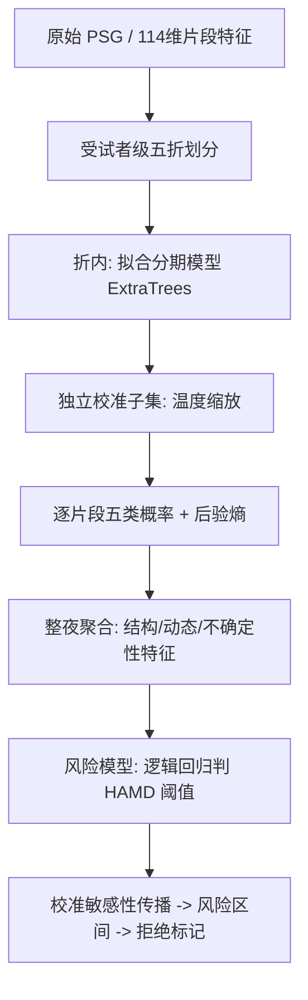

# 基于睡眠脑电分期后验的抑郁风险辅助评估：中期研究说明

> 说明：本文为中期答辩的研究说明稿。为便于评审，文中对信息来源做了分级标注：
> **【事实】**表示论文明确报告或本仓库数据/结果可直接核对的内容；**【推断】**表示基于事实的合理推理；**【假设】**表示尚待验证的研究设想；**【探索性结果】**表示本课题已跑出、但因样本或流程限制暂不能作为定论的结果；**【待验证】/【待补充】/【待核验】**表示尚未完成或尚未核实的内容。
> 代填口径（答辩前需本人确认）：主任务取 HAMD 阈值分类；BDI 相关任务与连续严重度回归列为未通过的探索；输入按“分期用单通道、特征文件含多通道”如实分述；计算资源限定 CPU；研究阶段为探索性验证；目标期刊未知。

---

## 一、研究问题概述

本课题研究对象是接受整夜多导睡眠监测（PSG，即在睡眠中同时记录脑电、眼电、肌电等信号的检查）的阻塞性睡眠呼吸暂停（OSA）人群。数据来自公开的 APPLES 队列，主分析样本 798 人，每人一整晚、约上千个 30 秒片段。

要回答的核心问题是：**在人口学、OSA 严重度和常规睡眠结构指标之外，由睡眠分期模型产生的“逐片段判别不确定性”，能否额外提高对个体抑郁症状风险（以汉密尔顿抑郁量表 HAMD 总分是否达到阈值来衡量）的判别能力。**

值得研究的原因有两点。其一，抑郁与睡眠结构异常存在公认的关联，而睡眠分期模型内部的“犹豫程度”这一信息，通常被丢弃，没有被用作下游特征。其二，把这种不确定性显式量化并传播到风险判别，理论上还能标记出“模型自己都拿不准”的个体，供人工复核。

验证方式是：在严格按受试者划分的交叉验证下，比较“是否加入校准后的不确定性特征”对 HAMD 阈值分类的影响，并检验一种基于校准敏感性的拒绝机制能否识别高错误率个体。

---

## 二、研究背景

抑郁的筛查目前主要依赖量表和临床访谈，缺少客观、可规模化的生理指标。睡眠是一个候选入口：抑郁人群常见 REM 睡眠提前、深睡减少、夜间觉醒增多等结构性异常，这类异常有综述层面的证据支持 [1]。**【事实】** 这构成了“从睡眠信号评估抑郁”的现实动机。

要从整夜睡眠中提取结构信息，第一步通常是睡眠分期，即把每个 30 秒片段判为 W（清醒）、N1、N2、N3、REM 五类之一。近年的深度分期模型在多个公开库上已接近专家一致性水平 [2,3]。**【事实】** 也就是说，“把睡眠分好期”这一步本身已经比较成熟。

问题在于下一步。多数工作把分期结果压成一张离散的睡眠图（hypnogram），再统计各期占比、时长等宏观指标去预测疾病。这样做丢掉了一个信息：模型对每个片段给出的其实是五类概率分布，而不只是一个硬标签。当模型在两个睡眠阶段之间犹豫时，这种“分布有多分散”本身可能携带睡眠稳定性的信息 [3]。**【事实】**关于这种不确定性，已有系统的理论框架把它区分为数据本身导致的（aleatoric）和模型知识不足导致的（epistemic）两类 [4]。**【事实】**

但把不确定性从“分期阶段的副产物”转化为“下游疾病判别的显式特征”，尤其是把它一路传播到抑郁风险层，目前的公开证据并不充分。已有的不确定性应用，多数停留在分期任务内部：用它来决定哪些片段交给医生复核，从而提升与金标准的一致性 [4,5,6,7]。**【事实】** 这就是本课题切入的位置。

---

## 三、相关研究

下表按“研究路线”归类对比，而非逐篇罗列。所列结论均为各论文实际报告的内容，DOI 见文末，未核实项已标注。

| 研究 | 数据与对象 | 任务 | 方法 | 主要结论 | 局限 | 与本研究的关系 |
|---|---|---|---|---|---|---|
| L-SeqSleepNet [2] | 4 个公开库，头皮/耳内 EEG | 睡眠分期 | 全周期长序列建模 | 单通道即达 SOTA 级 κ | 只做分期，不涉抑郁 | 提供“分期表征”思路的上游依据 |
| SleepTransformer [3] | SleepEDF/SHHS | 分期+不确定性 | Transformer+后验熵 | 后验熵可量化分期置信 | 未接下游疾病 | 本课题不确定性特征的直接来源 |
| van Gorp 2022 [4] | 理论/多库 | 不确定性框架 | aleatoric/epistemic 分解 | 给出不确定性理论定义 | 不含疾病终点 | 为“熵作特征”提供概念基础 |
| Kang 2021 [5] | 20 例单通道 | 分期+人工复核 | 熵驱动 human-in-loop | κ 平均提升约 0.28，省约 60% 评分时间 | 样本极小 | 支持“拒绝不确定样本”的思路 |
| Bechny 2024 [6] | 19,578 例 PSG | 分期+复核 | 置信网络 | 复核少于 29% 的不确定片段即达高一致性 | 无抑郁终点 | 拒绝机制的大样本旁证 |
| U-PASS [7] | 老年 OSA 临床 | 分期+拒绝 | 半监督+不确定性 | 准确率由 75% 升至 85% | 单中心、非抑郁 | 拒绝机制的效果旁证 |
| SleepFM [8] | 65,000 人/585,000 小时 | 多病预测 | 多模态基础模型 | 可预测上百种疾病含精神障碍 | 需大数据、GPU；作者声明相关非因果 | 说明深度表征路线已被大体量团队占据 |

比较后的判断：

- **共识**：睡眠与抑郁有关联 [1]；分期后验熵能刻画分期不确定性 [3,4]；在分期任务内，用不确定性做人工复核能提升一致性 [5,6,7]。**【事实】**
- **争议/空白**：把“校准后的分期不确定性”作为特征，显式传播到**抑郁风险判别层**，并据此构造可拒绝的输出，公开证据不足。**【推断】** 这是一个“已有相邻研究、但该组合尚未被充分回答”的空白，而非“从未有人研究”。
- **与本研究关系**：本课题属于**在一个特定组合上的补充验证**，不是提出全新模型。创新性判断为“有相关工作、存在可验证空白（C 级）”，**现有检索证据不足以声称“首次提出”。**【推断】

---

## 四、研究问题与假设

一句话研究问题：**在 APPLES 的 OSA 人群中，校准后的睡眠分期不确定性特征，能否在常规睡眠与临床特征之外提高 HAMD 阈值分类，并支撑一种可靠的拒绝机制。**

**假设 H1（主假设）**：在相同的受试者级交叉验证下，加入校准熵特征的模型（记为 E4），其 HAMD 阈值分类 AUROC 高于仅用睡眠结构与动态特征的模型（记为 E3）。
- 输入：114 维片段特征汇总成的整夜特征 + 人口学 + OSA 指标；输出：HAMD 总分是否 ≥ 8；对照：E3。
- 支持条件：E4 相对 E3 的配对 AUROC 增量，其自助置信区间下界大于 0。
- 不支持条件：区间跨 0 或为负。
- 证据不足判定：区间过宽或方向随划分翻转，则记为探索性，不下结论。
- 与价值的关系：若成立，说明“分期不确定性”携带独立于宏观结构的信息。

**假设 H2（扩展假设）**：对分期温度参数施加小幅扰动并传播到风险评分后，跨越判定阈值的个体，其错误率显著高于稳定个体，且高于同覆盖率下按“评分离阈值远近”拒绝的简单基线。
- 支持条件：跨阈值组错误率明显高于稳定组，且相对简单边距基线有增益。
- 不支持条件：跨阈值组与简单边距基线表现相当。
- 与价值的关系：若仅与简单基线持平，则扩展步骤的附加价值有限。**【假设】**

需要显式声明的边界：BDI 分类、连续 HAMD/BDI 回归**不作为主假设**，因为它们在探索中未获稳定增量（见第八节）。**【事实】**

---

## 五、数据集与适用边界

**数据来源与规模。** APPLES 是一项关于 OSA 的多中心研究，本仓库合并后的临床队列共 1073 人，来自 5 个中心（编号 SU/UA/SM/SL/BW）。**【事实，来自 `analysis_cohort.csv`】** 经“有 YASA 特征且有效睡眠超过 4 小时”筛选后，主分析样本为 798 人。**【事实】**

**标签。** 抑郁标签来自 HAMD 与 BDI 量表。主任务用 HAMD 总分 ≥ 8 作为阳性。在 798 人中 HAMD 阳性 147 人。**【事实，来自 `risk_stability/metrics.json`】** BDI 阳性人数更少，具体值**【待补充】**。这意味着存在明显的类别不平衡（阳性约占五分之一或更低），评价时不能只看准确率。**【推断】**

**模态口径（需澄清）。** 分期建模读取的是 YASA 特征文件中的 114 维片段特征；同一 `.npz` 的通道元数据同时列出 `C3_M2、C4_M1、O1_M2、O2_M1、LOC、EMG`，即包含多个脑电导联、眼电与肌电。**【事实】** 因此严格说，这些特征并非“纯单通道脑电”。114 维各列分别来自哪个通道、如何计算，其生成脚本尚未在本仓库确认。**【待核验】** 答辩中应如实表述为“基于多通道 PSG 派生的片段特征”，不宜简称单通道。

**数据能否回答问题。** 能部分回答：APPLES 同时具备整夜 PSG、睡眠指标与抑郁量表，可支持“睡眠特征 → 抑郁症状”的横断面判别。**【推断】** 但它本质是 OSA 队列，OSA 严重度、年龄、BMI、中心与抑郁症状相互纠缠，模型可能学到 OSA 或中心差异这类“捷径”。**【推断】** 因此临床变量必须作为对照单列，不能笼统说“仅凭脑电”。

**泄漏与划分。** 现有分期与下游实验均按受试者划分，同一人的所有片段留在同一折。**【事实，见代码】** 需要强调：报告的“样本量”在分期层是**片段数**（近 80 万），在抑郁判别层是**受试者数**（798）；能代表泛化能力的是后者。**【事实】**

**适用边界。** 结论只能推广到与 APPLES 类似的成年 OSA 人群，不能外推到普通人群、青少年或非 OSA 抑郁患者；量表与 PSG 的采集时间、版本与缺失机制尚未逐项核对，**【待核验】** 所以只能表述为“症状风险辅助评估”，不能表述为“诊断”或“未来发病预测”。

---

## 六、方法与选择理由

按数据流顺序说明。整体流程如下：

图的含义：每一折先在训练受试者上拟合分期模型，再用一批**独立的**校准受试者做温度缩放，避免校准偷看测试数据；随后把逐片段概率汇总为整夜特征，送入风险模型；最后对分期的校准参数做扰动，观察风险评分是否跨过阈值。

**第一步，分期模型用 ExtraTrees（极端随机树）。** 它把许多决策树的判断平均起来，适合处理 114 维这类表格特征。选它的直接理由是同协议下的对照结果：ExtraTrees 分期准确率 0.765、宏 F1 0.650、校准后 ECE 0.016；线性 SGD 分期准确率 0.687、宏 F1 0.630、校准后 ECE 0.166。**【事实，见 `posterior_extratrees` 与 `posterior` 的 staging_metrics.json】** ExtraTrees 在总体准确率和概率质量上更好。**需要如实补充**：SGD 的平衡准确率（0.731）反而更高，说明 ExtraTrees 并非各项都占优；且尚未与随机森林、梯度提升等同类模型做同协议对照。**【事实/待验证】** 所以“选 ExtraTrees”是当前阶段的工程选择，不是已证明的最优。

**第二步，用温度缩放做概率校准。** 校准，是指让模型输出的概率与真实正确率对齐。因为下游要用“概率的熵”，如果概率本身过度自信，熵就会系统性偏小。温度缩放只调一个参数 T：
$$q_k=\frac{p_k^{1/T}}{\sum_j p_j^{1/T}}$$
其中 $p_k$ 是原始第 k 类概率，$q_k$ 是校准后概率，T>1 使分布更平缓，T<1 更集中。正的 T 不改变最大概率的类别，因此一般不改变分期准确率。**【事实】** 选它是因为只有一个参数、计算便宜、可解释；本课题各折拟合出的 T 在 0.68 到 0.76 之间，校准后 ECE 由 0.083 降到 0.016。**【事实】** 但这只说明概率质量变好，**不等于**熵已成为抑郁生物标志物。**【推断】**

**第三步，整夜特征聚合。** 把逐片段概率汇总成整夜层面的睡眠结构、阶段动态与不确定性（如整夜平均后验熵、阶段边界附近的熵）特征。这一步把“片段级信息”变成“个体级特征”，才能与个体的抑郁量表对齐。**【事实】**

**第四步，风险模型判 HAMD 阈值。** 用逻辑回归，参数少、可解释、在小样本下不易过拟合，适合 798 人规模。**【推断】** 所有预处理、特征选择与调参都只在训练折内进行。**【事实，见代码】**

**第五步（扩展），校准敏感性传播。** 对每个受试者自己的温度参数乘以 ±5%/±10%/±15%，重算熵特征，用同一风险模型得到多个评分，取上下界成区间；若区间跨过 0.5 阈值，则标记为“待复核”。选它是因为无需重训分期模型、CPU 可完成，且能给出“模型拿不准”的显式信号。**【事实】** 风险在于：扰动幅度是工程容差，不是统计置信区间，不能解释成严格的概率保证。**【事实，metrics.json 已注明】**

对每一步的作用，都用对照或消融验证：分期模型用 SGD 与 ExtraTrees 对照；校准用校准前后 ECE/NLL 对照；不确定性特征用 E3 与 E4 消融；拒绝机制用“简单评分边距拒绝”作对照基线。

---

## 七、实验设计

| 实验 | 验证的问题 | 对照方法 | 主要指标 | 判断方式 |
|---|---|---|---|---|
| 分期基线 | 分期与校准是否可靠 | SGD vs ExtraTrees | 准确率/宏F1/ECE/NLL | 校准后 ECE 下降且准确率不劣 |
| E3→E4 消融（主） | H1：熵特征是否有增量 | E3 结构动态 | AUROC/AUPRC | E4−E3 配对区间下界>0 |
| E5/E6 消融 | 更复杂特征是否更好 | E4 | AUROC | 是否优于 E4 |
| 校准敏感性（扩展） | H2：跨阈值组是否更易错 | 简单评分边距拒绝 | 跨阈值率/两组错误率 | 跨阈值组错误率显著更高且优于基线 |
| 留一中心 | 跨中心是否稳健 | 同上 | AUROC/错误率 | 换中心后方向是否一致 |

**划分与泄漏控制。** 主实验用受试者级嵌套交叉验证（外层评估、内层调参），并做留一中心验证。避免泄漏的关键做法：同一受试者不跨折；分期与校准用不同受试者；所有预处理只在训练折估计。**【事实，见代码】**

**基线选择理由。** E3 代表“传统睡眠结构+动态”的常规做法，是检验熵特征增量的合理参照；拒绝实验用“评分离阈值远近”作基线，因为这是最朴素、最可能达到同样效果的替代方案，必须先排除它。**【推断】**

**统计报告。** 增量用受试者级配对自助法给出估计与 95% 区间。**【事实】** 需要补充的项：随机种子重复、跨多任务比较的多重检验校正目前**【待验证/待补充】**。

**探索性与正式验证的界线。** 由于模型、标签阈值与扰动范围在分析过程中被多次查看，现有结果应视为**探索性**；只有在冻结假设、指标、划分后，再在此前未用过的数据上复算，才算正式验证。**【事实】**

---

## 八、当前结果

以下数字均来自本仓库结果文件，可逐项核对。

**分期与校准。**【探索性结果】 ExtraTrees 五折均值：准确率 0.765、宏 F1 0.650；校准后 ECE 由 0.083 降到 0.016、NLL 由 0.636 降到 0.610。说明分期概率质量确实改善；**不能**说明熵与抑郁有关。

**主假设 H1（HAMD 阈值分类）。**【探索性结果】

| 特征集 | 嵌套CV AUROC | 留一中心 AUROC |
|---|---|---|
| E3 结构+动态 | 0.6348 | 0.6242 |
| E4 +校准熵 | 0.6745 | 0.6589 |
| E5 +条件残差 | 0.6617 | 0.6458 |
| E6 +周期相位 | 0.6466 | 0.6169 |

E4 相对 E3 的配对增量：嵌套 0.0401（区间 0.0108 至 0.0712），留一中心 0.0347（区间 0.0021 至 0.0682），两者区间下界均大于 0。**这在当前划分下支持 H1**：校准熵带来了可测量的增量。**【探索性结果】** 但需注意：E5、E6 相对 E4 为负增量（如 E5−E4 嵌套 −0.0128，区间不含 0），说明“更多不确定性特征”并不更好，堆叠特征会掉点。**【事实】** 结果**不能**支持“发现了通用抑郁标志物”，因为 BDI 分类、连续回归未获稳定增量，且未做跨数据集外部验证。**【事实】**

**扩展假设 H2（校准敏感性拒绝）。**【探索性结果】 阈值 0.5、±10% 扰动下：嵌套 CV 有 44 人（5.51%）跨阈值，其错误率 61.36%，稳定组 33.02%；留一中心 41 人（5.14%）跨阈值，错误率 53.66%，稳定组 34.35%。跨阈值组确实更易错。**当前不能确认它优于简单评分边距基线**：同覆盖率下的边距对照组错误率与之接近，二者差异是否显著尚未做统计检验。**【事实/待验证】** 因此 H2 目前只得到“方向性支持”，附加价值待证。

**其他合理解释。** 跨阈值个体本就多数靠近 0.5，错误率偏高可能主要来自“靠近决策边界”这一朴素事实，而非扰动传播提供了新信息。**【推断】** 这正是必须与边距基线对比的原因。

---

## 九、方法的优势与局限

**优势（均对应具体设计或结果）。**
- 计算成本低：全流程 CPU 可复现，不需训练深度网络。**【事实】**
- 泄漏控制较严：受试者级划分、分期与校准受试者分离、折内预处理。**【事实】**
- 概率质量有改善：校准后 ECE 明显下降。**【事实】**
- 主假设在两种协议下方向一致：嵌套与留一中心都显示 E4>E3。**【探索性结果】**

**局限（说明影响与缓解方向）。**
- 效应量偏小：AUROC 约 0.67，阈值分类离临床可用还远；影响是结论只能停在“有增量”，缓解需更大样本或更强特征。**【推断】**
- 缺外部验证：仅 APPLES 单队列；影响是无法判断跨设备/跨人群稳健性；缓解需独立队列复算。**【事实】**
- 混杂未完全拆解：OSA/中心/年龄可能是捷径；缓解需分层分析或协变量校正的稳健性检验。**【推断】**
- 输入口径未澄清：114 维特征的通道来源与生成脚本未确认；影响是“单通道”表述可能不成立；缓解需追溯上游特征提取。**【待核验】**
- 拒绝机制价值待证：尚未证明优于简单基线；缓解需补统计检验与基线对比。**【待验证】**

---

## 十、研究价值

按证据强度分层表述。

- **已获初步支持的贡献**：在 APPLES 上，校准后的分期不确定性对 HAMD 阈值分类提供了可测量的增量（H1，探索性）。**【探索性结果】**
- **候选贡献（尚待验证）**：一种 CPU 可复现、带拒绝机制的辅助评估流程；其相对简单基线的增益尚未证明。**【假设】**
- **方法价值**：把“分期不确定性”从分期任务内部的复核信号，尝试延伸到下游抑郁判别层。这一组合的充分公开证据不足，但**不能声称“首次提出”**，需以正式查新为准。**【推断】**
- **工程/潜在专利价值**：可能形成“校准参数扰动 → 风险区间 → 跨阈值拒绝”的具体技术步骤；能否授权取决于查新与权利要求，**【待核验】**，不作承诺。

---

## 十一、后续工作

| 后续工作 | 为什么需要 | 验证什么 | 可能改变的结论 | 若不支持如何调整 |
|---|---|---|---|---|
| 澄清 114 维特征来源 | 关系“单通道”表述是否成立 | 通道与特征定义 | 输入口径与结论表述 | 改为多通道口径重述 |
| 拒绝机制 vs 边距基线做统计检验 | H2 价值待证 | 是否显著优于基线 | 扩展部分能否保留 | 降级为“稳健性提示”而非独立贡献 |
| 随机种子重复+多重比较校正 | 现有为单次探索 | 结果稳定性 | 增量是否稳健 | 若不稳，收窄为定性结论 |
| 混杂稳健性分析 | OSA/中心可能是捷径 | 校正后增量是否仍在 | H1 的可信度 | 若消失，明确标注混杂驱动 |
| 外部队列验证 | 仅单队列 | 跨人群是否成立 | 可推广性 | 若不成立，限定适用边界 |
| 冻结协议后正式复算 | 现有结果参与过选型 | 预注册式验证 | 探索→正式 | 若翻转，回到问题重定义 |

---

## 十二、总结

- **阶段**：探索性验证阶段，尚未进入冻结协议的正式验证。
- **当前最可信的发现**：在 APPLES、受试者级交叉验证下，校准后的分期不确定性特征对 HAMD 阈值分类有可测量的小幅增量（嵌套 +0.0401，留一中心 +0.0347），且方向在两种协议下一致。**【探索性结果】**
- **最大的不确定性**：效应量小、仅单队列、拒绝机制未证明优于简单基线、输入通道口径未澄清。
- **下一阶段最关键的验证**：先澄清特征来源与混杂，再冻结协议在独立数据上复算 H1；对 H2 补做与边距基线的统计对比。

---

## 答辩时需要重点解释的问题

1. **“单通道”还是多通道？** 依据现有证据回答：分期建模读的是 YASA 114 维特征，其通道元数据含 4 个脑电导联加眼电、肌电，故应表述为“多通道 PSG 派生特征”；确切列来源待核验，答辩中不宜简称单通道。

2. **为什么主任务是 HAMD 分类，而不是当初的 BDI 回归？** 因为探索中只有 HAMD 阈值分类在 ExtraTrees 上获得稳定增量；BDI 分类与连续回归未获稳定增量。这是根据结果调整任务，属于探索性发现，尚需冻结协议后正式验证，不能称已实现最初目标。

3. **AUROC 约 0.67 有什么用？** 只能支持“不确定性携带独立信息”这一科学判断，不能支持临床可用；四者（统计显著、实际有效、临床有效、工程可用）需分开表述。

4. **E4 比 E3 高，会不会是偶然或混杂？** 配对自助区间下界大于 0，方向在嵌套与留一中心一致，属较稳的探索性证据；但 OSA/中心混杂尚未拆解，需补稳健性分析，故暂不下因果结论。

5. **拒绝机制的价值？** 跨阈值组错误率确实更高，但尚未证明优于“评分离阈值远近”的简单基线，需补统计检验；在此之前只作方向性提示。

6. **有没有数据泄漏？** 分期与下游均按受试者划分、校准用独立受试者、预处理折内估计；但 114 维特征的上游生成过程与两层划分是否隔离尚待核验，答辩中应如实说明这一未闭环之处。

7. **创新性够不够？** 定位为“已有相邻研究、组合尚未充分回答”的补充验证（C 级空白），不使用“首次提出/填补空白”，最终以正式查新为准。

---

## 参考文献

> DOI 或出处标“待核验”者，表示本轮未逐字核实官方页面，答辩前应自行确认。

[1] Riemann D, et al. Sleep, insomnia, and depression. *Neuropsychopharmacology*, 2020, 45:74–89. DOI: 10.1038/s41386-019-0411-y（待核验）

[2] Phan H, et al. L-SeqSleepNet: Whole-cycle Long Sequence Modelling for Automatic Sleep Staging. *IEEE JBHI*, 2023. arXiv:2301.03441.

[3] Phan H, et al. SleepTransformer: Automatic Sleep Staging With Interpretability and Uncertainty Quantification. *IEEE TBME*, 2022, 69(8):2456–2467. DOI 待核验。

[4] van Gorp H, et al. Certainty about Uncertainty in Sleep Staging: a Theoretical Framework. *Sleep*, 2022, 45(8):zsac134. DOI: 10.1093/sleep/zsac134.

[5] Kang DY, et al. Statistical uncertainty quantification to augment clinical decision support: a first implementation in sleep medicine. *npj Digital Medicine*, 2021, 4:142. DOI: 10.1038/s41746-021-00515-3.

[6] Bechny M, et al. Bridging AI and Clinical Practice: Integrating Automated Sleep Scoring Algorithm with Uncertainty-Guided Physician Review. *Nature and Science of Sleep*, 2024. DOI: 10.2147/NSS.S455649（待核验）。

[7] Heremans ERM, et al. U-PASS: An uncertainty-guided deep learning pipeline for automated sleep staging. *Computers in Biology and Medicine*, 2024, 171:108205. DOI: 10.1016/j.compbiomed.2024.108205.

[8] Thapa R, et al. A multimodal sleep foundation model for disease prediction. *Nature Medicine*, 2026, 32(2):752–762. DOI: 10.1038/s41591-025-04133-4. PMID: 41495409.

[9] APPLES 队列设计与结局论文（Quan SF 等 2011 *Sleep* 设计论文；Kushida CA 等 2012 *Sleep* 结局论文），具体卷期与 DOI 待核验。
